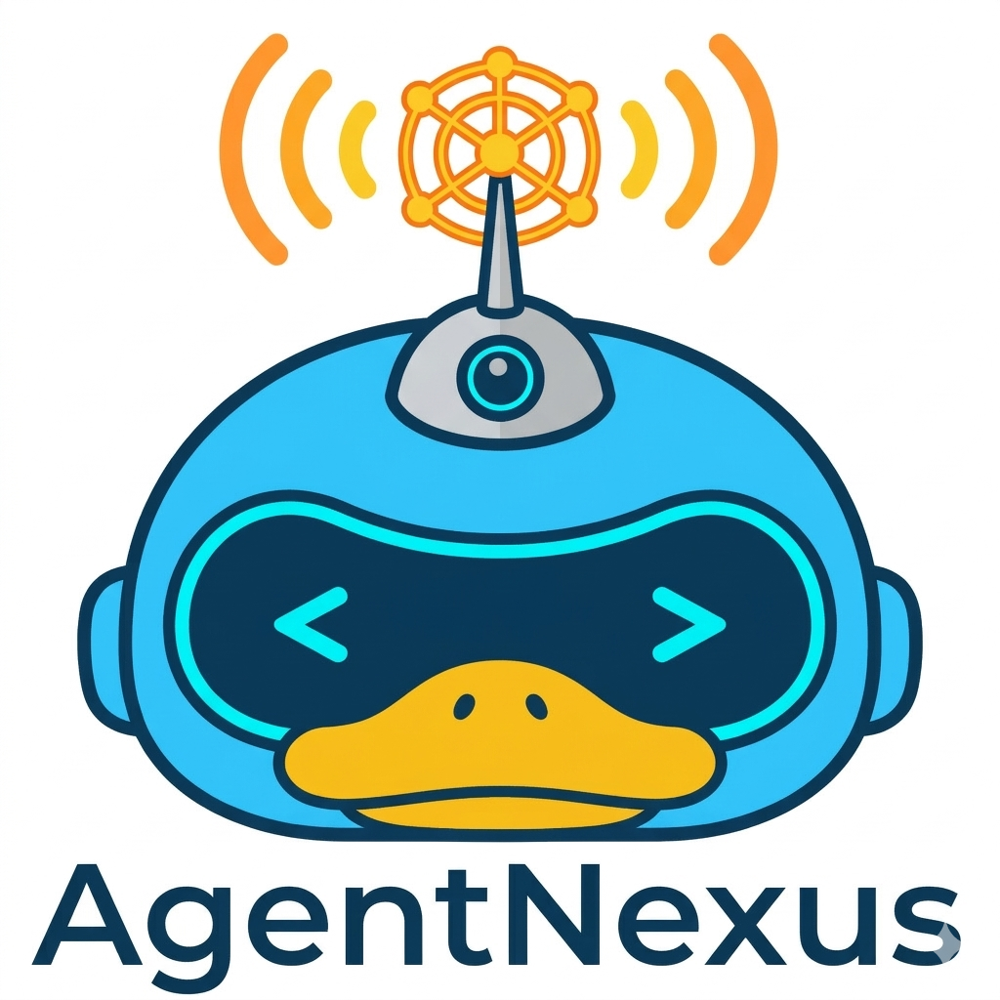

<div align="center">
  

  # AgentNexus

  **Agent-native communication and teamwork infrastructure.**

  **为 AI Agent 提供身份、通信、发现、授权、共享产物与团队协作编排。**

  [](LICENSE)
  [](https://python.org)
  [](https://github.com/kevinkaylie/AgentNexus/actions)
  [](https://github.com/kevinkaylie/AgentNexus/actions/workflows/ci.yml)

  **[中文](#中文) | [English](#english)**
</div>

---

## 中文

### AgentNexus 是什么

AgentNexus 最初的目标是做 **AI Agent 的微信 / WhatsApp**：每个 Agent 都有自己的 DID 地址，可以互相发现、握手、安全通信和跨网络投递消息。

随着 Agent 的真实使用场景演进，单纯“让 Agent 互相发消息”还不够。企业和个人更需要的是：

- 谁在发起任务，代表谁发起任务。
- 哪些 Agent 能参与这个项目组。
- 中间产物放在哪里，谁能读写。
- 流程走到哪一步，失败时谁接管。
- 如何避免 PM Agent 把完整聊天历史塞进上下文，导致 token 爆炸。

因此，AgentNexus 当前的产品定位收敛为：

> 基于 DID、Relay、加密消息、访问控制、Vault 和 Playbook 的 Agent 团队协作与流程编排底座。

开发团队协作是第一个高频模板，但不是唯一场景。同一套机制也适用于客服升级、采购审批、合同审查、风控复核、运营工单、研究协作等任何流程化团队工作。

---

### 为什么不是只用本机 PM Agent？

像 OpenClaw / Claude Code / 其他 CLI Agent 作为本机 PM，已经可以拉起多个本地角色完成协作。AgentNexus 不否认这种方式，反而把它视为一种重要 Adapter。

AgentNexus 的价值在更底层：

| 本机 PM 方案常见问题 | AgentNexus 的处理方式 |
|----------------------|------------------------|
| 主要面向单机，本地团队强，跨机器/局域网弱 | DID + Relay + Push + Presence 支持本机和局域网 Worker |
| PM 长聊天上下文不断膨胀，token 成本失控 | Context Snapshot + Handoff Checkpoint + Artifact Ref，默认不传完整聊天历史 |
| 任务结果容易变成自由文本，难追踪 | Enclave Vault + Delivery Manifest，阶段产物结构化落盘 |
| 谁能代表谁发起任务不清楚 | Owner DID + actor_did + Secretary 子 Agent + Capability Token |
| CLI 命令执行边界依赖约定 | CLI Worker 作为可选 Adapter，命令模板、工作目录、凭据边界可独立设计 |
| 失败、重试、接管状态分散在对话里 | Playbook Run / StageExecution / retry_count / Owner takeover 状态化 |

简单说：OpenClaw / CLI Agent 更像“执行端和交互端”，AgentNexus 是它们之下的 **身份、消息、授权、项目组、共享状态和交付协议层**。

---

### 核心能力

| 能力 | 说明 |
|------|------|
| DID 身份 | 每个 Agent 拥有 `did:agentnexus:<multikey>`，支持 Owner DID 管理多个子 Agent |
| 加密握手 | Ed25519 身份验证、X25519 密钥协商、AES-256-GCM 加密通信 |
| 联邦发现与路由 | 本地直投、P2P、Relay、离线存储、Push 通知 |
| MCP 与 SDK | Claude Desktop / Cursor / Claude Code 可通过 MCP 使用，Python SDK 支持 async/sync |
| Action Layer | 任务委派、认领、资源同步、状态汇报 |
| Discussion Protocol | 多 Agent 讨论、引用回复、投票、结论归档 |
| Enclave 项目组 | 多 Agent 项目空间，成员角色、权限、VaultBackend 和 Playbook 绑定 |
| VaultBackend | Local/Git 后端保存需求、设计、代码差异、测试报告、评审报告等产物 |
| Playbook 编排 | 按阶段自动推进任务，支持 rejected 回退、retry_count 和状态查询 |
| Secretary 编排 | 常驻秘书 Agent 接单、选人、建 Enclave、启动 Playbook、回传结果 |
| Context Budget | 用 Snapshot、Checkpoint、Artifact Ref 控制阶段交接上下文大小 |
| Governance & Trust | Web of Trust、声誉、治理认证、RuntimeVerifier 信任评估 |
| Capability Token | 签名授权信封、约束哈希、委托链收窄、撤销 |

---

### 当前状态

| 模块 | 状态 |
|------|------|
| DID / Relay / Gatekeeper / RuntimeVerifier | 已实现 |
| Python SDK / MCP / 平台适配器 | 已实现 |
| Push 注册与通知 | 已实现 |
| Enclave / Vault / Playbook | 已实现 |
| Owner DID / 消息中心 / 意图路由 | 已实现或进行中 |
| Capability Token / 委托链 | 已实现 |
| Secretary Orchestration Phase A | 已实现 |
| Secretary Orchestration Phase B | 开发与代码评审中 |
| Web Dashboard | 开发中 |

项目状态以 [docs/project-status.md](docs/project-status.md) 为准。

---

### 协作链路

```text
OpenClaw / Webhook / SDK / CLI / Social Adapter
  -> Secretary Agent
  -> Worker Registry + Presence
  -> Enclave Project Group
  -> Playbook Run
  -> Worker Agents
  -> Vault Artifacts + Delivery Manifest
  -> Result Callback / Owner Takeover
```

这个链路把“聊天式协作”收敛为可追踪的流程对象：

| 对象 | 作用 |
|------|------|
| `session_id` | 外部入口会话 |
| `run_id` | 一次 Playbook 执行 |
| `message_id` | 单条消息去重、防重放和审计 |
| `enclave_id` | 项目组隔离边界 |
| `stage_execution` | 阶段执行状态、Worker、task_id、output_ref、retry_count |
| `delivery manifest` | 阶段和最终交付包索引 |

---

### 架构概览

```text
┌─────────────────────────────────────────────────────────┐
│          Agent / CLI / OpenClaw / Dify / Custom App      │
└──────────────────────┬──────────────────────────────────┘
                       │ MCP / SDK / Webhook / Adapter
┌──────────────────────▼──────────────────────────────────┐
│              AgentNexus Node Daemon (:8765)              │
│  DID · Auth · Router · Secretary · Enclave · Vault        │
│  Playbook · Message Center · Trust · Capability Token     │
└──────────────────────┬──────────────────────────────────┘
                       │ P2P / Relay / Push
┌──────────────────────▼──────────────────────────────────┐
│              AgentNexus Relay Server (:9000)             │
│             Federated discovery and delivery             │
└─────────────────────────────────────────────────────────┘
```

详细架构见 [docs/architecture.md](docs/architecture.md)。

---

### 快速开始

```bash
git clone https://github.com/kevinkaylie/AgentNexus.git
cd AgentNexus
pip install -r requirements.txt

# Terminal 1: Relay
python main.py relay start

# Terminal 2: Node Daemon
python main.py node start

# Terminal 3: MCP Agent
python main.py node mcp --name "MyAssistant" --caps "Chat,Search"
```

Python SDK:

```python
import agentnexus

nexus = await agentnexus.connect("Developer", caps=["Code", "Review"])
await nexus.send(to_did="did:agentnexus:z6Mk...", content="Hello")
```

Orchestration SDK:

```python
import agentnexus

admin = await agentnexus.connect("Team Admin", caps=["Admin"])
owner = await admin.owner.register("Kevin")

secretary = await admin.secretary.register(owner.did, name="Team Secretary")

developer = await agentnexus.connect("Developer", caps=["developer", "code"])
await admin.owner.bind(owner.did, developer.agent_info.did)

result = await admin.secretary.dispatch(
    session_id="sess_login_001",
    owner_did=owner.did,
    actor_did=secretary.did,
    objective="完成登录模块设计、实现、测试和评审",
    required_roles=["developer"],
)

print(result.run_id, result.enclave_id)
```

完整教程见 [docs/quickstart.md](docs/quickstart.md)。

---

### 团队协作示例

AgentNexus 当前推荐的团队协作入口是 Orchestration SDK：Owner DID 管理团队成员，Secretary Agent 代表 Owner 接单和调度，Worker Runtime 负责阶段执行与产物交付。

#### 1. Owner + Secretary + Worker

```python
admin = await agentnexus.connect("Team Admin", caps=["Admin"])
owner = await admin.owner.register("Kevin")

secretary = await admin.secretary.register(owner.did, name="Team Secretary")

developer = await agentnexus.connect("Developer", caps=["developer", "code"])
await admin.owner.bind(owner.did, developer.agent_info.did)

result = await admin.secretary.dispatch(
    session_id="sess_login_001",
    owner_did=owner.did,
    actor_did=secretary.did,
    objective="完成登录模块设计、实现、测试和评审",
    required_roles=["developer"],
    source={"channel": "sdk", "message_ref": "msg_001"},
)
```

#### 2. Worker Runtime：阶段执行

```python
worker = await agentnexus.connect(did=developer.agent_info.did)

@worker.worker.on_stage(role="developer")
async def handle_stage(ctx):
    spec = await ctx.vault.get("design/spec.md")
    patch = implement(spec.value)
    await ctx.deliver(
        kind="code_diff",
        key="impl/diff.patch",
        value=patch,
        summary="完成登录模块实现",
    )
```

每个阶段只接收必要的 Context Snapshot 和 Artifact Ref。正文产物写入 Enclave Vault，最终由 Delivery Manifest 汇总，避免 PM Agent 在上下文里携带完整聊天历史。

#### 3. Run 查询与 Owner 接管

```python
status = await admin.runs.get_status(
    result.enclave_id,
    result.run_id,
    actor_did=secretary.did,
)

await admin.secretary.abort(
    session_id="sess_login_001",
    actor_did=owner.did,
    reason="需求变更，终止本次 run",
)
```

旧的 `send / propose_task / notify_state` Action Layer 仍然兼容，适合轻量点对点协作；复杂团队流程建议使用 Secretary + Enclave + Playbook 主链路。

专题设计见 [docs/design/design-secretary-orchestration.md](docs/design/design-secretary-orchestration.md) 和 [docs/design/design-sdk-orchestration.md](docs/design/design-sdk-orchestration.md)。

---

### 文档导航

| 文档 | 内容 |
|------|------|
| [docs/project-status.md](docs/project-status.md) | 当前版本、模块状态、测试数量，项目唯一状态源 |
| [docs/quickstart.md](docs/quickstart.md) | 注册、发现、通信、MCP 使用 |
| [docs/architecture.md](docs/architecture.md) | DID、Relay、路由、Gatekeeper、信任架构 |
| [docs/design.md](docs/design.md) | 设计文档索引 |
| [docs/design/design-secretary-orchestration.md](docs/design/design-secretary-orchestration.md) | 常驻秘书与 Agent 团队协作编排 |
| [docs/design/design-sdk-orchestration.md](docs/design/design-sdk-orchestration.md) | Orchestration SDK 改造 |
| [docs/api-reference.md](docs/api-reference.md) | Daemon / Relay API |
| [docs/mcp-setup.md](docs/mcp-setup.md) | MCP 工具和客户端配置 |
| [docs/scenarios.md](docs/scenarios.md) | 单机、局域网、多应用、公网协作场景 |
| [docs/adr/](docs/adr/) | 架构决策记录 |
| [docs/commands.md](docs/commands.md) | CLI 命令速查 |

---

### 技术栈

| 组件 | 技术 |
|------|------|
| 后端 | FastAPI + Uvicorn |
| 异步 | Python asyncio |
| 存储 | SQLite + aiosqlite |
| HTTP | aiohttp |
| 加密 | PyNaCl + cryptography |
| MCP | mcp >= 1.0.0 |
| 前端 | Vue 3 + Vite + PrimeVue |
| Python | 3.10+ |

---

## English

AgentNexus is agent-native communication and teamwork infrastructure.

It started as “WhatsApp for AI Agents”: every agent gets a DID address, discovers peers, performs secure handshakes, and exchanges messages across local or federated networks.

The current product direction goes one layer deeper into real workflows:

> DID identity + secure messaging + routing + access control + project vault + playbook orchestration for multi-agent teams.

### Why Not Just A Local PM Agent?

Local PM agents and CLI-based teams are useful, and AgentNexus treats them as adapters. The missing infrastructure usually appears when teams need more than a single local context window:

| Pain Point | AgentNexus Approach |
|------------|---------------------|
| Single-machine bias | DID + Relay + Push + Presence for local and LAN workers |
| Context explosion | Context Snapshot + Handoff Checkpoint + Artifact Ref |
| Free-form outputs | Vault artifacts + Delivery Manifest |
| Weak actor boundary | Owner DID + actor_did + secretary sub-agent + capability token |
| Unclear process state | Enclave + Playbook Run + StageExecution |
| Manual failure recovery | retry_count, fallback, Owner takeover |

### Core Capabilities

| Capability | Description |
|------------|-------------|
| DID identity | Self-certifying agent identities and Owner DID hierarchy |
| Secure messaging | Ed25519, X25519, AES-256-GCM |
| Federated routing | local, P2P, Relay, offline storage, Push |
| MCP and SDK | Claude Desktop / Cursor / Claude Code and Python SDK support |
| Collaboration protocol | task propose, claim, resource sync, state notify |
| Enclave | project group with members, roles, permissions and Vault |
| Playbook | stage-based orchestration with status and retry tracking |
| Secretary orchestration | intake, worker selection, Enclave creation, result callback |
| Context budget | bounded handoff context instead of full chat history |
| Trust and governance | Web of Trust, reputation, attestations, RuntimeVerifier |
| Capability token | signed authorization envelope with delegation constraints |

### Quick Start

```bash
git clone https://github.com/kevinkaylie/AgentNexus.git
cd AgentNexus
pip install -r requirements.txt

python main.py relay start
python main.py node start
python main.py node mcp --name "MyAssistant" --caps "Chat,Search"
```

Python SDK:

```python
import agentnexus

nexus = await agentnexus.connect("Developer", caps=["Code", "Review"])
await nexus.send(to_did="did:agentnexus:z6Mk...", content="Hello")
```

Orchestration SDK:

```python
admin = await agentnexus.connect("Team Admin", caps=["Admin"])
owner = await admin.owner.register("Kevin")
secretary = await admin.secretary.register(owner.did, name="Team Secretary")

developer = await agentnexus.connect("Developer", caps=["developer", "code"])
await admin.owner.bind(owner.did, developer.agent_info.did)

result = await admin.secretary.dispatch(
    session_id="sess_login_001",
    owner_did=owner.did,
    actor_did=secretary.did,
    objective="Implement and review login module",
    required_roles=["developer"],
)
```

### Documentation

| Doc | Content |
|-----|---------|
| [Project Status](docs/project-status.md) | Current status and test count |
| [Quick Start](docs/quickstart.md) | Register, discover, chat, MCP |
| [Architecture](docs/architecture.md) | DID, Relay, routing, trust |
| [Design Index](docs/design.md) | Design documents |
| [Secretary Orchestration](docs/design/design-secretary-orchestration.md) | Teamwork orchestration design |
| [Orchestration SDK](docs/design/design-sdk-orchestration.md) | Owner, Secretary, Team, Run and Worker Runtime SDK design |
| [API Reference](docs/api-reference.md) | Daemon and Relay APIs |
| [MCP Setup](docs/mcp-setup.md) | MCP tools and client config |
| [Scenarios](docs/scenarios.md) | Local, LAN and public collaboration scenarios |

---

## License

Copyright 2025-2026 kevinkaylie and AgentNexus Contributors

Licensed under the Apache License, Version 2.0. See [LICENSE](LICENSE) for details.
