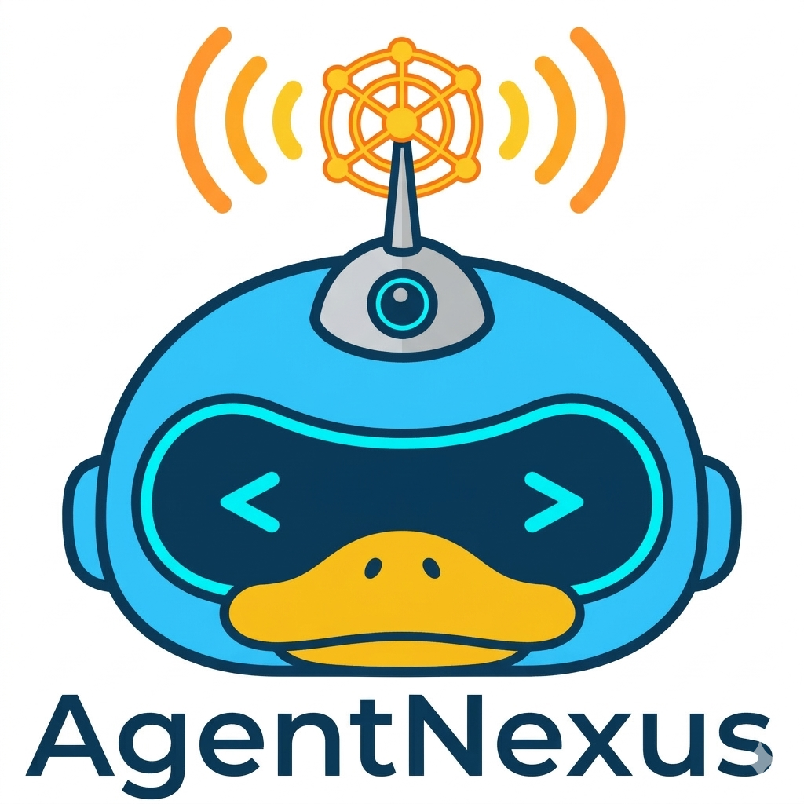

<div align="center">
  

  # AgentNexus

  **A framework for trustworthy collaboration among independent agents.**

  **面向独立 Agent 的可信协作框架。**

  [](LICENSE)
  [](https://python.org)
  [](https://github.com/kevinkaylie/AgentNexus/actions)
  [](https://github.com/kevinkaylie/AgentNexus/actions/workflows/ci.yml)

  **[中文](#中文) | [English](#english)**
</div>

---

## 中文

### 项目定位

AgentNexus 的研究重点正在从 **Agent Communication** 转向
**Agent Collaboration**，长期探索 **Agent Society**。目标不是再发明一种
Agent 通信协议，而是定义陌生、独立运营的 Agent 如何发现彼此、建立身份、
请求元数据、交换证据、协商能力与权限、建立 Session、协同完成任务并留下
可审计记录。

框架遵循三条边界：

> 定义表达，不定义真理。
>
> 交换证据，不替代决策。
>
> 支持协作，不接管传输和行业规则。

其中最重要的一条是：

> **框架标准化的是证据交换，而不是信任结论。**

规范层由 RFC 定义，现有 DID、Relay、Gatekeeper、Enclave、Playbook 和
Objective Loop 代码是参考实现与实验场，不是协议真理：

| RFC | 内容 | 状态 |
|-----|------|------|
| [RFC-000](specs/rfcs/000-agent-collaboration-framework.md) | Agent Collaboration Framework 的边界、对象模型与 RFC 家族 | Draft |
| [RFC-001](specs/rfcs/001-agent-discovery-and-identity.md) | 相互独立的 Agent Discovery 与 Identity Establishment 语义 | Draft |
| [RFC-002](specs/rfcs/002-metadata-requirements-and-evidence-exchange.md) | Receiver 驱动的元数据要求与证据交换 | Draft |

### Developer Preview

AgentNexus 当前适合技术预览、协议评审和本机多 Agent 工作流试用。推荐从以下入口开始：

| 目标 | 入口 |
|------|------|
| 先理解框架边界与核心原则 | [RFC-000](specs/rfcs/000-agent-collaboration-framework.md) |
| 了解现有产品和参考实现 | [产品概览](docs/product.md) |
| 跑通基础 DID / Relay / MCP 通信 | [快速开始](docs/quickstart.md) |
| 跑通 7-stage coding coordination 闭环 | [Coding Coordination Quickstart](docs/quickstart-coding-coordination.md) |
| 试用 v1.1 L0 本机 Objective Loop | [Objective Loop Quickstart](docs/quickstart-objective-loop.md) |
| 查看当前完成度和风险 | [项目现状速览](docs/project-status.md) |
| 参与推广、反馈或集成讨论 | [推广与发布清单](docs/promotion.md) |

当前规范定位：**为独立 Agent 建立可信协作关系定义通用语义与生命周期**。
当前代码定位：上述框架的参考实现与开发者预览。v1.1 只承诺 L0 本机
Objective Loop；LAN / Relay 远程 Worker、桌面壳、per-agent token、Strict
JCS 和签名交付包属于后续版本。L0 真实 Worker 烟测已跑通：
script/pytest、Claude CLI、OpenClaw CLI 以 3 个 Worker DID 完成同一条
Objective Loop。


### AgentNexus 是什么

AgentNexus 最初的目标是做 **AI Agent 的微信 / WhatsApp**：每个 Agent
都有自己的 DID 地址，可以互相发现、握手、安全通信和跨网络投递消息。

随着 Agent 的真实使用场景演进，项目认识到通信只是传输基础，真正缺失的是
多个独立 Agent 建立可信协作关系的共同语义：

- 谁在发起任务，代表谁发起任务。
- 接收方需要哪些元数据和证据，发送方愿意披露什么。
- 哪些 Agent 能参与这个项目组。
- 中间产物放在哪里，谁能读写。
- 流程走到哪一步，失败时谁接管。
- 结果由谁产生、基于什么授权，以及如何审计、撤销或争议。

因此，AgentNexus 当前的顶层定位是：

> Agent Collaboration Framework：定义协作参与者、协作语义、证据交换、
> 能力与权限、Session 生命周期、结果和审计记录，以及到不同传输的映射。

面向 v1.1，**异构 Agent 的网络原生目标循环（Objective Loop）** 是这一
框架的首个重点参考实现：

> 让本机、局域网和公网 Relay 上的 Worker，在 DID 身份、授权委托、产物交接、验收收据和秘书人机交互下，自动协作完成目标。

这意味着 AgentNexus 不只是在多个 Agent 之间传消息，也不只是本机多 Agent team mode。它的目标是给定一个 objective 后，系统能持续规划、分派、执行、验收、返工或升级人工决策，直到目标达成、失败闭环或由 Owner 接管。

开发团队协作是第一个高频模板，但不是唯一场景。同一套机制也适用于客服升级、采购审批、合同审查、风控复核、运营工单、研究协作等任何流程化团队工作。

---

### 为什么不是只用本机 PM Agent？

像 OpenClaw / Claude Code / 其他 CLI Agent 作为本机 PM，已经可以拉起多个本地角色完成协作。AgentNexus 不否认这种方式，反而把它视为一种重要 Adapter。

AgentNexus 的价值在更底层：

| 本机 PM 方案常见问题 | AgentNexus 的处理方式 |
|----------------------|------------------------|
| 主要面向单机，本地团队强，跨机器/局域网弱 | DID + Relay + Push + Presence 支持本机和局域网 Worker |
| PM 长聊天上下文不断膨胀，token 成本失控 | Context Snapshot + Handoff Checkpoint + Artifact Ref，默认不传完整聊天历史 |
| 任务结果容易变成自由文本，难追踪 | Enclave Vault + Delivery Manifest，阶段产物结构化落盘 |
| 谁能代表谁发起任务不清楚 | Owner DID + actor_did + Secretary 子 Agent + Capability Token |
| CLI 命令执行边界依赖约定 | CLI Worker 作为可选 Adapter，命令模板、工作目录、凭据边界可独立设计 |
| 失败、重试、接管状态分散在对话里 | Playbook Run / StageExecution / retry_count / Owner takeover 状态化 |

简单说：OpenClaw / Codex / Claude Code / CLI Agent 更像“执行端和交互端”，AgentNexus 是它们之下的 **身份、消息、授权、项目组、共享状态、目标循环和交付协议层**。

---

### 核心能力

| 能力 | 说明 |
|------|------|
| DID 身份 | 每个 Agent 拥有 `did:agentnexus:<multikey>`，支持 Owner DID 管理多个子 Agent |
| 加密握手 | Ed25519 身份验证、X25519 密钥协商、AES-256-GCM 加密通信 |
| 联邦发现与路由 | 本地直投、P2P、Relay、离线存储、Push 通知 |
| MCP 与 SDK | Claude Desktop / Cursor / Claude Code 可通过 MCP 使用，Python SDK 支持 async/sync |
| Action Layer | 任务委派、认领、资源同步、状态汇报 |
| Discussion Protocol | 多 Agent 讨论、引用回复、投票、结论归档 |
| Enclave 项目组 | 多 Agent 项目空间，成员角色、权限、VaultBackend 和 Playbook 绑定 |
| VaultBackend | Local/Git 后端保存需求、设计、代码差异、测试报告、评审报告等产物 |
| Playbook 编排 | 按阶段自动推进任务，支持 rejected 回退、retry_count 和状态查询 |
| Secretary 编排 | 常驻秘书 Agent 接单、选人、建 Enclave、启动 Playbook、回传结果 |
| Objective Loop（v1.1 主线） | 以目标完成为停止条件，跨本机 / 局域网 / 公网 Relay 自动分派、执行、验收、返工和升级人工决策 |
| Context Budget | 用 Snapshot、Checkpoint、Artifact Ref 控制阶段交接上下文大小 |
| Trust Evidence 与本地策略 | Web of Trust、声誉和治理认证作为证据输入，由 Receiver 的 RuntimeVerifier 本地评估 |
| Capability Token | 签名授权信封、约束哈希、委托链收窄、撤销 |

---

### 当前状态

| 模块 | 状态 |
|------|------|
| DID / Relay / Gatekeeper / RuntimeVerifier | 已实现 |
| Python SDK / MCP / 平台适配器 | 已实现 |
| Push 注册与通知 | 已实现 |
| Enclave / Vault / Playbook | 已实现 |
| Owner DID / 消息中心 / 意图路由 | 已实现 |
| Capability Token / 委托链 | 已实现 |
| Orchestration SDK | 已实现 |
| 鉴权矩阵 v3 | 已实现 v1.0 阶段性边界 |
| Secretary Orchestration Phase A | 已实现 |
| Secretary Orchestration Phase B | 已完成开发候选 |
| Web Dashboard / Setup | 设计完成，开发中 |

当前 `v1.0.x` 范围是团队协作开发者预览：Orchestration SDK + Secretary Phase B 基础闭环 + Web Dashboard 基础入口。Coding Coordination V1 release closure 已完成，SDK facade、CLI demo、runtime-mock、Dashboard detail、Quickstart 和 Delivery Manifest closure 都已可验证。

`v1.1` 主线是 Objective Loop：把 Local Runner、Execution Backend、Loop Engine、Secretary 人工决策点和 Dashboard 详情页串成一条本机自动目标闭环。当前 L0-Ready hardening 和 3 Worker DID 真实本机烟测已完成；LAN / Relay Worker 后移到 v1.2+。设计见 [docs/design/design-objective-loop-v1.1.md](docs/design/design-objective-loop-v1.1.md)。

项目状态以 [docs/project-status.md](docs/project-status.md) 为准。

---

### 协作链路

```text
OpenClaw / Webhook / SDK / CLI / Social Adapter
  -> Secretary Agent
  -> Objective Loop Engine
  -> Worker Registry + Presence + Runtime Adapter
  -> Enclave Project Group
  -> Playbook Run
  -> Worker Agents
  -> Vault Artifacts + Delivery Manifest
  -> Result Callback / Owner Takeover
```

这个链路把“聊天式协作”收敛为可追踪的流程对象：

| 对象 | 作用 |
|------|------|
| `session_id` | 外部入口会话 |
| `coordination_session_id` | 跨 Agent 协作的审计、权限和聚合容器 |
| `run_id` | 一次 Playbook 执行 |
| `message_id` | 单条消息去重、防重放和审计 |
| `enclave_id` | 项目组隔离边界 |
| `objective` | 目标、验收条件、约束和人工决策策略 |
| `stage_execution` | 阶段执行状态、Worker、task_id、output_ref、retry_count |
| `delivery manifest` | 阶段和最终交付包索引 |

---

### 架构概览

```text
┌─────────────────────────────────────────────────────────┐
│          Agent / CLI / OpenClaw / Dify / Custom App      │
└──────────────────────┬──────────────────────────────────┘
                       │ MCP / SDK / Webhook / Adapter
┌──────────────────────▼──────────────────────────────────┐
│              AgentNexus Node Daemon (:8765)              │
│  DID · Auth · Router · Secretary · Objective Loop          │
│  CoordinationSession · Enclave · Vault · PlaybookRun       │
│  Trust · Capability Token · Runtime Adapter                │
└──────────────────────┬──────────────────────────────────┘
                       │ P2P / Relay / Push
┌──────────────────────▼──────────────────────────────────┐
│              AgentNexus Relay Server (:9000)             │
│             Federated discovery and delivery             │
└─────────────────────────────────────────────────────────┘
```

详细架构见 [docs/architecture.md](docs/architecture.md)。

---

### 快速开始

```bash
git clone https://github.com/kevinkaylie/AgentNexus.git
cd AgentNexus
pip install -r requirements.txt

# Terminal 1: Relay
python main.py relay start

# Terminal 2: Node Daemon
python main.py node start

# Terminal 3: MCP Agent
python main.py node mcp --name "MyAssistant" --caps "Chat,Search"
```

Python SDK:

```python
import agentnexus

nexus = await agentnexus.connect("Developer", caps=["Code", "Review"])
await nexus.send(to_did="did:agentnexus:z6Mk...", content="Hello")
```

Orchestration SDK:

```python
import agentnexus

admin = await agentnexus.connect("Team Admin", caps=["Admin"])
owner = await admin.owner.register("Kevin")

secretary = await admin.secretary.register(owner.did, name="Team Secretary")

developer = await agentnexus.connect("Developer", caps=["developer", "code"])
await admin.owner.bind(owner.did, developer.agent_info.did)

result = await admin.secretary.dispatch(
    session_id="sess_login_001",
    owner_did=owner.did,
    actor_did=secretary.did,
    objective="完成登录模块设计、实现、测试和评审",
    required_roles=["developer"],
)

print(result.run_id, result.enclave_id)
```

完整教程见 [docs/quickstart.md](docs/quickstart.md)。

Coding Coordination V1 的最短可验证路径：

```bash
python main.py node coordination demo
python main.py node coordination runtime-mock <coordination_session_id> <run_id> design --actor <secretary_did>
```

demo 会输出 Dashboard URL，详情页可查看 timeline、artifact、receipt、closure 和写入 Enclave Vault 的 Delivery Manifest。

---

### 团队协作示例

AgentNexus 当前推荐的团队协作入口是 Orchestration SDK：Owner DID 管理团队成员，Secretary Agent 代表 Owner 接单和调度，Worker Runtime 负责阶段执行与产物交付。

#### 1. Owner + Secretary + Worker

```python
admin = await agentnexus.connect("Team Admin", caps=["Admin"])
owner = await admin.owner.register("Kevin")

secretary = await admin.secretary.register(owner.did, name="Team Secretary")

developer = await agentnexus.connect("Developer", caps=["developer", "code"])
await admin.owner.bind(owner.did, developer.agent_info.did)

result = await admin.secretary.dispatch(
    session_id="sess_login_001",
    owner_did=owner.did,
    actor_did=secretary.did,
    objective="完成登录模块设计、实现、测试和评审",
    required_roles=["developer"],
    source={"channel": "sdk", "message_ref": "msg_001"},
)
```

#### 2. Worker Runtime：阶段执行

```python
worker = await agentnexus.connect(did=developer.agent_info.did)

@worker.worker.on_stage(role="developer")
async def handle_stage(ctx):
    spec = await ctx.vault.get("design/spec.md")
    patch = implement(spec.value)
    await ctx.deliver(
        kind="code_diff",
        key="impl/diff.patch",
        value=patch,
        summary="完成登录模块实现",
    )
```

每个阶段只接收必要的 Context Snapshot 和 Artifact Ref。正文产物写入 Enclave Vault，最终由 Delivery Manifest 汇总，避免 PM Agent 在上下文里携带完整聊天历史。

#### 3. Run 查询与 Owner 接管

```python
status = await admin.runs.get_status(
    result.enclave_id,
    result.run_id,
    actor_did=secretary.did,
)

await admin.secretary.abort(
    session_id="sess_login_001",
    actor_did=owner.did,
    reason="需求变更，终止本次 run",
)
```

旧的 `send / propose_task / notify_state` Action Layer 仍然兼容，适合轻量点对点协作；复杂团队流程建议使用 Secretary + CoordinationSession + Enclave + PlaybookRun 主链路。其中 CoordinationSession 负责审计、权限和聚合，PlaybookRun 负责 `current_stage/status` 等运行态。

专题设计见 [docs/design/design-secretary-orchestration.md](docs/design/design-secretary-orchestration.md)、[docs/design/design-sdk-orchestration.md](docs/design/design-sdk-orchestration.md)、[docs/design/design-coding-coordination-v1.md](docs/design/design-coding-coordination-v1.md)、[docs/design/design-coding-coordination-v1-release.md](docs/design/design-coding-coordination-v1-release.md) 和 [docs/design/design-dashboard-setup-v1.0.md](docs/design/design-dashboard-setup-v1.0.md)。

---

### 文档导航

| 文档 | 内容 |
|------|------|
| [RFC-000](specs/rfcs/000-agent-collaboration-framework.md) | Agent Collaboration Framework 架构、原则与边界 |
| [RFC-001](specs/rfcs/001-agent-discovery-and-identity.md) | Agent Discovery 与 Identity Establishment |
| [RFC-002](specs/rfcs/002-metadata-requirements-and-evidence-exchange.md) | 元数据要求与证据交换 |
| [docs/project-status.md](docs/project-status.md) | 当前版本、模块状态、测试数量，项目唯一状态源 |
| [docs/quickstart.md](docs/quickstart.md) | 注册、发现、通信、MCP 使用 |
| [docs/architecture.md](docs/architecture.md) | DID、Relay、路由、Gatekeeper、信任架构 |
| [docs/design.md](docs/design.md) | 设计文档索引 |
| [docs/design/design-coding-coordination-v1.md](docs/design/design-coding-coordination-v1.md) | Coding Coordination V1 可信协调闭环 |
| [docs/design/design-coding-coordination-v1-release.md](docs/design/design-coding-coordination-v1-release.md) | V1 SDK / CLI / Dashboard / Quickstart 发布收口 |
| [docs/design/design-secretary-orchestration.md](docs/design/design-secretary-orchestration.md) | 常驻秘书与 Agent 团队协作编排 |
| [docs/design/design-sdk-orchestration.md](docs/design/design-sdk-orchestration.md) | Orchestration SDK 改造 |
| [docs/design/design-dashboard-setup-v1.0.md](docs/design/design-dashboard-setup-v1.0.md) | Dashboard / Setup v1.0 收口 |
| [docs/api-reference.md](docs/api-reference.md) | Daemon / Relay API |
| [docs/product.md](docs/product.md) | 产品定位和典型使用场景 |
| [docs/integrations/mcp.md](docs/integrations/mcp.md) | MCP 工具和客户端配置 |
| [docs/adr/](docs/adr/) | 架构决策记录 |

---

### 技术栈

| 组件 | 技术 |
|------|------|
| 后端 | FastAPI + Uvicorn |
| 异步 | Python asyncio |
| 存储 | SQLite + aiosqlite |
| HTTP | aiohttp |
| 加密 | PyNaCl + cryptography |
| MCP | mcp >= 1.0.0 |
| 前端 | Vue 3 + Vite + PrimeVue |
| Python | 3.10+ |

---

## English

AgentNexus is a framework for trustworthy collaboration among independently
operated agents.

Its focus is evolving from **Agent Communication** to **Agent Collaboration**,
with **Agent Society** as a longer-term research direction. The framework does
not replace transports such as HTTP, MCP, A2A, WebSocket, gRPC, or message
queues. It defines how unfamiliar agents discover one another, establish
identity, request metadata, exchange evidence, negotiate capabilities and
permissions, establish sessions, coordinate work, and produce auditable
records.

> Define expression, not domain truth.
>
> Exchange evidence, not trust conclusions.
>
> Support collaboration; do not take ownership of transport or domain policy.

Most importantly:

> **The framework standardizes evidence exchange, not trust decisions.**

The RFCs define the specification layer. The existing DID, Relay, Gatekeeper,
Enclave, Playbook, and Objective Loop modules are reference implementations
and experimentation surfaces:

| RFC | Scope | Status |
|-----|-------|--------|
| [RFC-000](specs/rfcs/000-agent-collaboration-framework.md) | ACF boundaries, core object model, lifecycle, and RFC family | Draft |
| [RFC-001](specs/rfcs/001-agent-discovery-and-identity.md) | Independently conformable discovery and identity-establishment semantics | Draft |
| [RFC-002](specs/rfcs/002-metadata-requirements-and-evidence-exchange.md) | Receiver-driven metadata requirements and evidence exchange | Draft |

### Developer Preview

AgentNexus is ready for technical preview, protocol review and local multi-agent workflow experiments. Start here:

| Goal | Entry |
|------|------|
| Understand the framework boundaries | [RFC-000](specs/rfcs/000-agent-collaboration-framework.md) |
| Review the current product and reference implementation | [Product Overview](docs/product.md) |
| Run basic DID / Relay / MCP messaging | [Quick Start](docs/quickstart.md) |
| Run the 7-stage coding coordination loop | [Coding Coordination Quickstart](docs/quickstart-coding-coordination.md) |
| Try the v1.1 L0 local Objective Loop | [Objective Loop Quickstart](docs/quickstart-objective-loop.md) |
| Check current status and risks | [Project Status](docs/project-status.md) |
| Help with launch, feedback or integrations | [Promotion Checklist](docs/promotion.md) |

Specification position: **common semantics and lifecycle for independently
operated agents to establish trustworthy collaboration**. The current code is
a reference implementation and developer preview. v1.1 only promises the L0
local Objective Loop; LAN / Relay workers, desktop shell, per-agent tokens,
Strict JCS and signed delivery packages are future work.
The L0 real-worker smoke path now completes with three Worker DIDs: script/pytest, Claude CLI and OpenClaw CLI.

It started as “WhatsApp for AI Agents”: every agent gets a DID address, discovers peers, performs secure handshakes, and exchanges messages across local or federated networks.

The framework direction goes one layer deeper than communication:

> Standardize participants, collaboration semantics, evidence exchange,
> capability and permission, session lifecycle, outcome and audit records, and
> mappings to existing transports.

For v1.1, the **network-native objective loop for heterogeneous agents** is a
primary reference implementation: local, LAN, and relay-connected workers
collaborate under DID identity, capability-bound delegation, artifact-based
handoff, receipt-gated progress, and human decision gates through a Secretary
Agent.

### Why Not Just A Local PM Agent?

Local PM agents and CLI-based teams are useful, and AgentNexus treats them as adapters. The missing infrastructure usually appears when teams need more than a single local context window:

| Pain Point | AgentNexus Approach |
|------------|---------------------|
| Single-machine bias | DID + Relay + Push + Presence for local and LAN workers |
| Context explosion | Context Snapshot + Handoff Checkpoint + Artifact Ref |
| Free-form outputs | Vault artifacts + Delivery Manifest |
| Weak actor boundary | Owner DID + actor_did + secretary sub-agent + capability token |
| Unclear process state | Enclave + Playbook Run + StageExecution |
| Manual failure recovery | retry_count, fallback, Owner takeover |

### Core Capabilities

| Capability | Description |
|------------|-------------|
| DID identity | Self-certifying agent identities and Owner DID hierarchy |
| Secure messaging | Ed25519, X25519, AES-256-GCM |
| Federated routing | local, P2P, Relay, offline storage, Push |
| MCP and SDK | Claude Desktop / Cursor / Claude Code and Python SDK support |
| Collaboration protocol | task propose, claim, resource sync, state notify |
| Enclave | project group with members, roles, permissions and Vault |
| Playbook | stage-based orchestration with status and retry tracking |
| CoordinationSession | audit, permission and aggregation container for multi-agent runs |
| Secretary orchestration | intake, worker selection, Enclave creation, result callback |
| Context budget | bounded handoff context instead of full chat history |
| Trust evidence and local policy | Web of Trust, reputation, and governance attestations as evidence inputs to receiver-local RuntimeVerifier decisions |
| Capability token | signed authorization envelope with delegation constraints |

### Quick Start

```bash
git clone https://github.com/kevinkaylie/AgentNexus.git
cd AgentNexus
pip install -r requirements.txt

python main.py relay start
python main.py node start
python main.py node mcp --name "MyAssistant" --caps "Chat,Search"
```

Python SDK:

```python
import agentnexus

nexus = await agentnexus.connect("Developer", caps=["Code", "Review"])
await nexus.send(to_did="did:agentnexus:z6Mk...", content="Hello")
```

Orchestration SDK:

```python
admin = await agentnexus.connect("Team Admin", caps=["Admin"])
owner = await admin.owner.register("Kevin")
secretary = await admin.secretary.register(owner.did, name="Team Secretary")

developer = await agentnexus.connect("Developer", caps=["developer", "code"])
await admin.owner.bind(owner.did, developer.agent_info.did)

result = await admin.secretary.dispatch(
    session_id="sess_login_001",
    owner_did=owner.did,
    actor_did=secretary.did,
    objective="Implement and review login module",
    required_roles=["developer"],
)
```

### Documentation

| Doc | Content |
|-----|---------|
| [RFC-000](specs/rfcs/000-agent-collaboration-framework.md) | ACF architecture, principles, and boundaries |
| [RFC-001](specs/rfcs/001-agent-discovery-and-identity.md) | Agent discovery and identity establishment |
| [RFC-002](specs/rfcs/002-metadata-requirements-and-evidence-exchange.md) | Metadata requirements and evidence exchange |
| [Project Status](docs/project-status.md) | Current status and test count |
| [Quick Start](docs/quickstart.md) | Register, discover, chat, MCP |
| [Architecture](docs/architecture.md) | DID, Relay, routing, trust |
| [Design Index](docs/design.md) | Design documents |
| [Coding Coordination V1](docs/design/design-coding-coordination-v1.md) | Trusted coding workflow loop |
| [Coding Coordination V1 Release Closure](docs/design/design-coding-coordination-v1-release.md) | SDK, CLI, Dashboard and Quickstart release closure |
| [Secretary Orchestration](docs/design/design-secretary-orchestration.md) | Teamwork orchestration design |
| [Orchestration SDK](docs/design/design-sdk-orchestration.md) | Owner, Secretary, Team, Run and Worker Runtime SDK design |
| [Dashboard / Setup v1.0](docs/design/design-dashboard-setup-v1.0.md) | v1.0 dashboard and setup closure |
| [API Reference](docs/api-reference.md) | Daemon and Relay APIs |
| [Product Overview](docs/product.md) | Positioning and usage scenarios |
| [MCP Integration](docs/integrations/mcp.md) | MCP tools and client config |

---

## License

Copyright 2025-2026 kevinkaylie and AgentNexus Contributors

Licensed under the Apache License, Version 2.0. See [LICENSE](LICENSE) for details.
