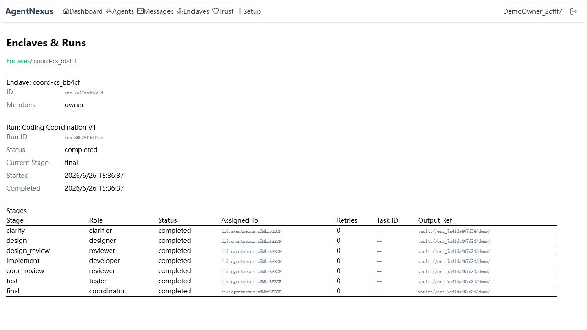
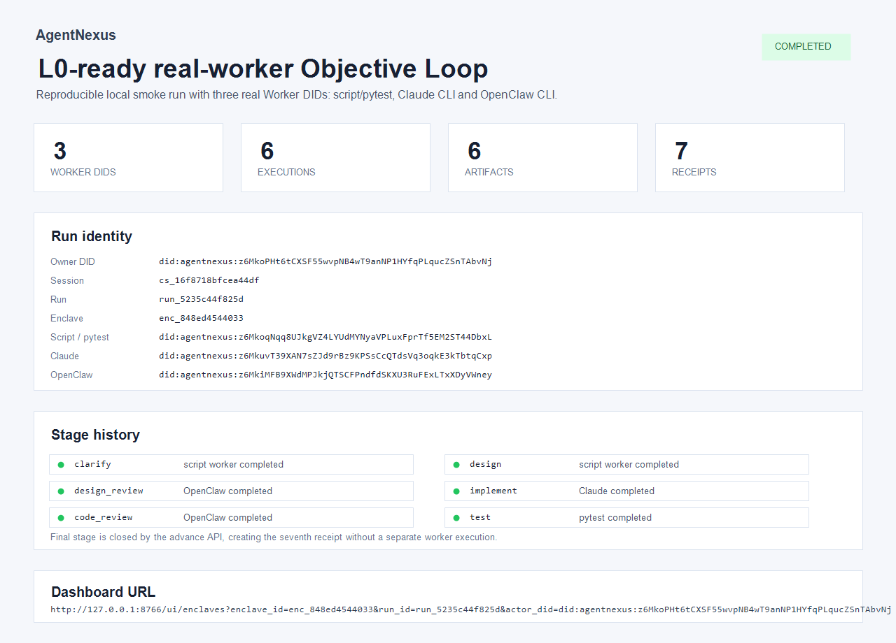

# AgentNexus Promotion Checklist

> Status: developer preview launch pack
> Last updated: 2026-06-29

## Positioning

AgentNexus is DID identity, authorization, artifact delivery and objective-loop collaboration infrastructure for AI agents.

Short version:

> AgentNexus lets local and networked AI workers coordinate through stable DID identities, bounded authority, shared artifacts, receipts and an auditable objective loop.

Do not lead with every subsystem at once. Lead with one problem:

> Local PM agents and multi-agent frameworks work well inside one process or one context window. AgentNexus gives those agents a shared protocol layer for identity, routing, project state, artifact handoff and objective completion.

## Launch Readiness

| Area | Weight | Current | To reach 100% |
|------|--------|---------|---------------|
| First-run experience | 25 | 22 | Keep `quickstart.md`, `quickstart-coding-coordination.md` and `quickstart-objective-loop.md` synchronized with current CLI behavior |
| Public positioning | 20 | 18 | Keep README focused on DID + authorization + artifacts + objective loop, not only "WhatsApp for agents" |
| Status consistency | 15 | 14 | Keep version, test count, release boundary and WIP aligned across README, `project-status.md`, package metadata and changelog |
| Demo proof | 20 | 19 | Keep the reproducible L0 real-worker smoke script and evidence screenshot aligned with current CLI behavior |
| Contribution surface | 10 | 8 | Keep issues, discussion prompts and integration asks small enough for early contributors |
| Distribution assets | 10 | 9 | Add a short GIF after the screenshot-based launch |

Current promotion readiness: about 90/100 after documentation, metadata, release notes, Dashboard screenshot fixes and the L0 real-worker smoke script.

## Launch Boundary

Use this exact scope for the first public push:

- This is a **developer preview**, not a production security claim.
- v1.0.x demonstrates secure agent identity, messaging, orchestration SDK, Secretary, Enclave, Playbook and Dashboard basics.
- Coding Coordination V1 demonstrates a complete artifact/receipt/manifest workflow.
- v1.1 preview demonstrates the **L0 local Objective Loop**.
- LAN workers, Relay workers, desktop shell, per-agent token, Strict JCS and signed delivery packages are future work.

Release notes draft: [v1.0.1 Developer Preview](releases/v1.0.1-developer-preview.md).

## Minimum Public Demo

The first promoted workflow should be:

```bash
git clone https://github.com/kevinkaylie/AgentNexus.git
cd AgentNexus
pip install -r requirements.txt
pip install -e agentnexus-sdk

python main.py node start
python main.py node objective demo
```

Expected result:

- A CoordinationSession is created.
- The objective moves through `clarify -> design -> design_review -> implement -> code_review -> test -> final`.
- Each stage creates an artifact and receipt.
- The Dashboard URL shows timeline, executions, artifacts, receipts and closure.

Current local evidence:




Dashboard launch fixes completed on 2026-06-26: API paths now resolve on the current origin, `actor_did` deep links can restore local identity, and run detail stage status now aggregates artifacts + approved receipts for Objective Loop demo runs.
L0-ready real-worker smoke completed on 2026-06-29: `scripts/l0_ready_real_workers_demo.py` registered three Worker DIDs and completed one Objective Loop with 6 executions, 6 artifacts and 7 receipts.

## First Outreach Targets

| Audience | Message angle |
|----------|---------------|
| Agent framework builders | "Use AgentNexus as the protocol layer under your runtime or team mode." |
| MCP / CLI agent users | "Give local workers stable identities, shared artifacts and an auditable objective loop." |
| AgentOps / enterprise workflow builders | "Separate execution, memory, artifacts, receipts and approvals instead of passing full chat history." |
| DID / trust / protocol communities | "Review the DID, capability and artifact handoff model." |

## Suggested Posts

### Short post

AgentNexus is now open as a developer preview.

It is a protocol/runtime layer for multi-agent collaboration: DID identity, secure messaging, capability-aware authorization, Enclave project groups, Vault artifacts, Playbook runs and an L0 local Objective Loop.

The goal is not another single-machine team mode. The goal is a shared coordination layer where local CLI agents, MCP agents and future remote workers can complete objectives through artifact handoff, receipts and human decision gates.

Repo: https://github.com/kevinkaylie/AgentNexus

### Technical post

Most multi-agent systems still pass too much state through chat context. AgentNexus takes a different route:

- each agent has a DID
- work happens inside a CoordinationSession and Enclave
- intermediate outputs are artifacts in a Vault
- stages advance through receipts
- failures, retries and human decisions are explicit state
- the Objective Loop decides whether to start, poll, advance, retry, block or close

The current release is a developer preview. It is focused on local L0 workflows first; LAN and Relay-connected workers come later.

Start with:

```bash
python main.py node start
python main.py node objective demo
```

Repo: https://github.com/kevinkaylie/AgentNexus

### Integration ask

Looking for feedback from people building CLI agents, MCP tools, multi-agent runtimes and AgentOps workflows.

The integration question is simple: what would your worker need to output so another agent can verify, accept, reject or continue its work without inheriting the full chat history?

AgentNexus currently uses artifact refs, receipts, delivery manifests and decision gates for that handoff model.

Repo: https://github.com/kevinkaylie/AgentNexus

## Issues To Open

Open these as small, contributor-friendly issues when the launch branch is merged:

1. Add Docker Compose quickstart for daemon + relay.
2. Add an integration example for a CLI coding worker.
3. Add a short GIF for the Objective Loop Dashboard after the screenshot-based launch.
4. Review DID/capability token wording for external protocol readers.

## Launch Gate

Before moving from developer preview to L0-ready preview:

- [ ] `python main.py node objective demo` works from a clean clone.
- [x] At least three real local Worker DIDs complete an L0 objective loop.
- [ ] README, `project-status.md`, package versions and test badges match.
- [x] A screenshot of the Dashboard is linked from README.
- [ ] The latest GitHub Actions CI run is green on `main`.
- [x] A GitHub release notes draft states the developer-preview boundary.
